# ADR-030 — Broker Service Architecture

| | |
|---|---|
| **Status** | Accepted |
| **Date** | 2026-07-31 |
| **Decision Makers** | Trading OS Architecture |
| **Related ADRs** | ADR-001 (Trading OS Vision and Product Philosophy), ADR-006 (Market Data Service Responsibilities), ADR-029 (Execution Domain) |

---

# Executive Summary

This Architecture Decision Record defines the architecture of the **Broker Service**, the integration layer responsible for connecting Trading OS with external brokers.

The Broker Service deliberately contains **no trading business logic**.

Its sole responsibility is to translate broker-neutral application requests into provider-specific operations and return standardized broker-neutral responses.

All provider-specific concerns—including authentication, transport protocols, request mapping, response mapping, error translation and communication resilience—are isolated inside this service.

Business concepts such as execution authorization, recovery, reconciliation strategies, retry policies and domain events remain exclusively owned by the Trading Core and, more specifically, by the Execution Domain described in ADR-029.

This strict separation allows Trading OS to support multiple brokers while keeping the business model completely independent from provider APIs.

---

# Context

Trading OS is built according to Hexagonal Architecture principles.

Business domains must remain isolated from infrastructure technologies.

External brokers introduce significant variability:

- authentication mechanisms;
- REST APIs;
- WebSocket APIs;
- request formats;
- response formats;
- error models;
- rate limits;
- communication reliability;
- provider-specific terminology.

Allowing these concerns to propagate into the Trading Core would introduce unnecessary coupling between business logic and infrastructure.

The Broker Service exists to isolate these concerns.

It acts as the single integration boundary between Trading OS and external broker platforms.

---

# Problem Statement

Without a dedicated Broker Service:

- Trading Core would depend directly on broker APIs.
- Provider DTOs would leak into business code.
- Authentication logic would be duplicated.
- Provider-specific errors would pollute domain logic.
- Supporting additional brokers would require business modifications.
- External API changes would impact Trading Core.

Such coupling would violate:

- Hexagonal Architecture;
- Single Responsibility Principle;
- Dependency Inversion Principle;
- Separation of Concerns.

A dedicated Broker Service removes these dependencies by introducing a stable broker-neutral integration layer.

---

# Goals

The Broker Service shall:

- isolate external broker implementations;
- expose broker-neutral contracts;
- support multiple broker providers;
- centralize provider authentication;
- centralize provider mapping;
- centralize provider error translation;
- provide resilient technical communication;
- expose comprehensive observability;
- evolve independently from Trading Core.

---

# Non-Goals

The Broker Service is **not responsible** for:

- trading strategy;
- execution authorization;
- risk management;
- execution lifecycle;
- recovery decisions;
- reconciliation decisions;
- retry policies;
- AI analysis;
- market analysis;
- portfolio analytics;
- business event publication.

Those responsibilities belong to the Trading Core.

---

# Architectural Principles

The Broker Service is governed by the following architectural principles.

## Business Ownership

Business ownership always remains inside the Trading Core.

The Broker Service owns technical communication only.

---

## Broker Neutrality

Every public contract exposed by the Broker Service is broker-neutral.

No provider-specific concepts leave the provider boundary.

---

## Infrastructure Isolation

Infrastructure technologies remain implementation details.

The Trading Core must never depend on:

- HTTP
- OpenFeign
- Provider SDKs
- Provider DTOs
- Authentication mechanisms

---

## Provider Independence

Every provider is implemented independently.

Adding a new provider must never require modifications to existing providers.

---

## Capability-Oriented Design

Provider implementations are composed of specialized capabilities rather than monolithic service implementations.

This architecture promotes modularity, extensibility and maintainability.

---

## Deterministic Behaviour

The Broker Service performs deterministic technical transformations only.

Business interpretation remains the responsibility of the Trading Core.

---

## Single Responsibility

The Broker Service reports technical facts.

The Trading Core assigns business meaning.

---

# Terminology

## Broker Provider

A concrete implementation supporting communication with one broker.

Examples include:

- Kraken
- Binance
- Interactive Brokers

---

## Capability

A provider component responsible for a single technical concern.

Examples:

- ExecutionCapability
- AuthenticationCapability
- AccountCapability

---

## Broker-Neutral Contract

An immutable application contract shared between Trading Core and Broker Service.

Examples:

- ExecutionRequest
- ExecutionResponse
- AccountSnapshot

---

## Provider DTO

A transport model representing a broker API request or response.

Provider DTOs never leave the provider implementation.

---

## Provider Mapper

A component responsible for translating between Provider DTOs and Broker-Neutral Contracts.

---

## Error Translator

A component responsible for translating provider-specific failures into broker-neutral exceptions.

---

# Architecture Overview

The Broker Service acts as a technical adapter positioned between the Trading Core and external brokers.

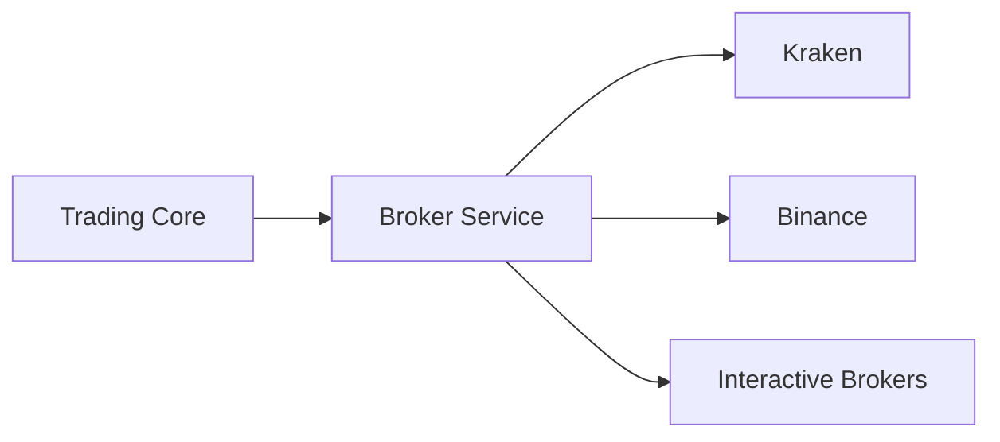

The Trading Core communicates exclusively through broker-neutral contracts.

Each provider encapsulates all provider-specific infrastructure concerns.

---

# Decisions

The following sections define the architectural decisions governing the Broker Service.

- Decision 1 — Broker Service Responsibilities
- Decision 2 — Public Broker-Neutral Contracts
- Decision 3 — Capability-Oriented Provider Architecture
- Decision 4 — Authentication Architecture
- Decision 5 — Provider Mapping Strategy
- Decision 6 — Error Translation Strategy
- Decision 7 — Resilience Strategy
- Decision 8 — Observability Strategy
- Decision 9 — Synchronous Technical Adapter
- Decision 10 — Trading Core Communication
- Decision 11 — Testing Strategy
- Decision 12 — Extensibility & Future Evolution

# Decision 1 — Broker Service Responsibilities

## Status

**Accepted**

---

## Decision

The Broker Service is a dedicated integration service responsible for all technical communication with external brokers.

Its mission is to isolate Trading OS from provider-specific infrastructure while exposing a stable, broker-neutral interface to the Trading Core.

The Broker Service owns **technical communication**, but it owns **no trading business logic**.

---

## Responsibilities

The Broker Service is responsible for:

### Broker Connectivity

- establishing communication with external brokers;
- managing provider clients;
- handling provider-specific communication protocols;
- maintaining technical connectivity.

---

### Provider Selection

Selecting the appropriate provider implementation according to the requested broker.

Provider resolution is completely transparent to the Trading Core.

---

### Authentication

Managing all provider-specific authentication mechanisms, including:

- API keys;
- request signing;
- timestamps;
- nonces;
- authentication headers;
- provider-specific security requirements.

Authentication is entirely contained within the Broker Service.

---

### Request Translation

Transforming broker-neutral application contracts into provider-specific requests.

Examples include:

- order submission requests;
- cancellation requests;
- reconciliation requests;
- account queries.

---

### Response Translation

Transforming provider-specific responses into broker-neutral application contracts.

Trading Core never processes provider DTOs directly.

---

### Account Operations

Providing access to broker account information, including:

- balances;
- account status;
- equity;
- margin information.

---

### Position Operations

Providing access to:

- open positions;
- position synchronization;
- broker position snapshots.

---

### Order Operations

Executing technical broker operations including:

- order submission;
- order cancellation;
- order lookup;
- order status retrieval.

The Broker Service executes technical operations only.

Business interpretation remains outside the service.

---

### Reconciliation Support

Providing the technical information required for reconciliation.

The Broker Service retrieves broker information.

The Execution Domain decides how reconciliation affects business state.

---

### Communication Resilience

Protecting communication with external brokers through infrastructure mechanisms such as:

- configurable timeouts;
- circuit breakers;
- provider-specific rate limiting;
- bulkheads;
- technical retries for safe read operations.

These mechanisms improve communication reliability without introducing business behaviour.

---

### Error Translation

Translating provider-specific failures into standardized broker-neutral exceptions.

The Trading Core never depends on:

- HTTP status codes;
- provider error payloads;
- provider error codes.

---

### Observability

Providing comprehensive technical observability through:

- structured logging;
- distributed tracing;
- infrastructure metrics;
- provider health indicators;
- technical audit information.

---

## Non-Responsibilities

The Broker Service is **not responsible** for:

- execution authorization;
- risk validation;
- trading strategy;
- AI analysis;
- market analysis;
- execution lifecycle;
- recovery decisions;
- retry decisions;
- reconciliation decisions;
- execution state transitions;
- domain event publication;
- trading analytics;
- portfolio management.

These responsibilities remain exclusively within the Trading Core.

---

## Architectural Boundary

The Broker Service forms the technical boundary between Trading OS and external brokers.

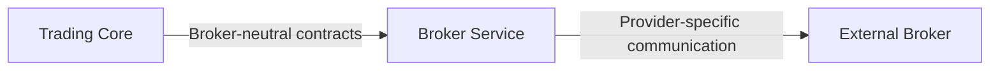

The Trading Core never communicates directly with external broker APIs.

---

## Rationale

External broker APIs evolve independently from Trading OS.

Each provider introduces its own:

- authentication model;
- request structure;
- response structure;
- communication protocol;
- operational limitations.

Isolating these concerns inside a dedicated service prevents infrastructure from leaking into business logic.

This separation enables Trading Core to evolve independently from provider implementations.

---

## Consequences

### Positive

- Complete isolation of broker APIs.
- Stable application contracts.
- Easier provider maintenance.
- Independent provider evolution.
- Simplified addition of new brokers.
- Improved testability.
- Reduced infrastructure coupling.

### Negative

- Additional microservice to maintain.
- Additional network hop between Trading Core and providers.
- Provider implementations require dedicated mapping and authentication components.

These trade-offs are considered acceptable given the long-term architectural benefits.

---

## Related Decisions

This decision is complemented by:

- **Decision 2** — Public Broker-Neutral Contracts
- **Decision 3** — Capability-Oriented Provider Architecture
- **Decision 9** — Broker Service as a Synchronous Technical Adapter


# Decision 2 — Public Broker-Neutral Contracts

## Status

**Accepted**

---

## Decision

The Broker Service exposes a set of immutable, broker-neutral application contracts shared with the Trading Core.

These contracts define the public language between both services and represent the only supported integration interface.

Provider-specific request and response models are strictly internal implementation details and must never cross the provider boundary.

---

## Rationale

Every broker exposes different APIs, payloads and naming conventions.

For example, different providers may use:

- different order identifiers;
- different status values;
- different timestamp formats;
- different numeric representations;
- different authentication metadata.

Exposing those models directly would tightly couple the Trading Core to external APIs.

Instead, the Broker Service translates every provider model into a stable domain-independent contract.

This creates a clear anti-corruption layer between Trading OS and broker implementations.

---

## Public Contract Categories

The Broker Service exposes three categories of contracts.

### Commands

Commands describe an action requested by the Trading Core.

Examples include:

- `ExecutionRequest`
- `CancelRequest`
- `ReconciliationRequest`

Commands are immutable and represent user or system intent.

---

### Responses

Responses describe the technical outcome of a completed broker operation.

Examples include:

- `ExecutionResponse`
- `CancelResponse`
- `ReconciliationResponse`

Responses never expose provider-specific payloads.

---

### Snapshots

Snapshots represent broker state at a specific instant.

Examples include:

- `AccountSnapshot`
- `PositionSnapshot`
- `OrderSnapshot`
- `FillSnapshot`

Snapshots are immutable representations of external state.

---

## Contract Ownership

The Broker Service owns the definition of all broker-neutral contracts.

Every provider implementation must translate its own models into these contracts.

The Trading Core communicates exclusively through them.

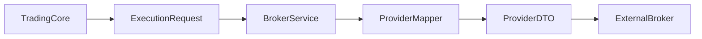

The reverse flow follows the same principle.

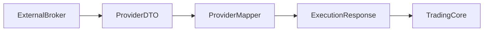

---

## Immutability

All public contracts should be immutable.

Java records are the preferred implementation whenever appropriate.

Example:

```java
public record ExecutionRequest(
    UUID executionId,
    BrokerAccountId accountId,
    InstrumentId instrument,
    OrderType orderType,
    Side side,
    BigDecimal quantity,
    BigDecimal price
) {}
```

Immutability guarantees:

- thread safety;
- predictable behaviour;
- easier testing;
- simpler serialization.

---

## Provider Isolation

Provider-specific models remain completely internal.

Examples include:

```text
KrakenExecutionRequest
KrakenExecutionResponse

BinanceExecutionRequest
BinanceExecutionResponse

InteractiveBrokersExecutionRequest
```

These models never appear outside their provider implementation.

---

## Forbidden Dependencies

The Trading Core must never depend on:

- provider DTOs;
- provider enums;
- provider JSON payloads;
- provider identifiers;
- provider SDK classes;
- provider-specific exceptions.

Every dependency must terminate at the Broker Service boundary.

---

## Stable Integration Boundary

Public contracts are intentionally stable.

Changes to a provider implementation must never require modifications to:

- Trading Core;
- Execution Domain;
- Risk Engine;
- Analytics components.

Only provider implementations should evolve.

---

## Versioning

Public contracts evolve through explicit versioning.

Breaking changes require:

- a new contract version;
- backward compatibility during migration;
- coordinated adoption across services.

This protects long-term interoperability between Trading Core and Broker Service.

---

## Design Principles

Public contracts represent business-neutral technical communication.

They are:

- provider-independent;
- immutable;
- stable;
- technology-agnostic;
- serialization-friendly.

They intentionally avoid exposing transport concerns or provider implementation details.

---

## Consequences

### Positive

- Stable service boundaries.
- Strong provider isolation.
- Easier provider replacement.
- Simplified testing.
- Reduced coupling.
- Long-term API stability.

### Negative

- Additional mapping layer.
- More application classes.
- Initial implementation effort is slightly higher.

These trade-offs are accepted because they significantly improve maintainability over the lifetime of Trading OS.

---

## Related Decisions

This decision is complemented by:

- **Decision 3 — Capability-Oriented Provider Architecture**
- **Decision 5 — Provider Mapping Strategy**
- **Decision 6 — Error Translation Strategy**

# Decision 3 — Capability-Oriented Provider Architecture

## Status

**Accepted**

---

## Decision

The Broker Service adopts a **capability-oriented provider architecture**.

Instead of exposing a single monolithic provider interface, each broker implementation is composed of a collection of specialized capabilities, each responsible for one technical concern.

Every provider assembles the capabilities it supports while exposing a unified provider interface to the rest of the Broker Service.

---

## Rationale

Different brokers do not necessarily expose the same features.

Some providers support:

- spot trading;
- margin trading;
- derivatives;
- advanced order types;
- account management.

Others expose only a subset of these capabilities.

A single provider interface containing every possible operation would quickly become large, difficult to maintain and would violate the **Interface Segregation Principle (ISP)**.

By decomposing providers into specialized capabilities:

- each component has a single responsibility;
- unsupported features remain absent instead of partially implemented;
- providers evolve independently;
- adding new capabilities does not affect existing providers.

---

## Provider Composition

A provider acts primarily as a composition root.

Example:

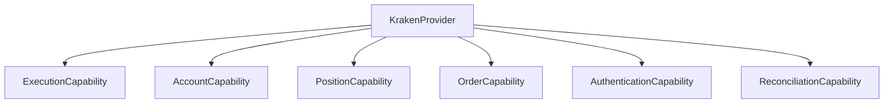

The provider itself contains very little business logic.

Its primary responsibility is coordinating its internal capabilities.

---

## Standard Capabilities

The initial Broker Service defines the following capabilities.

### ExecutionCapability

Responsible for:

- order submission;
- order cancellation.

This capability performs technical execution only.

Business validation remains outside the Broker Service.

---

### AccountCapability

Responsible for:

- account retrieval;
- balances;
- equity;
- margin information.

---

### PositionCapability

Responsible for:

- retrieving broker positions;
- synchronizing open positions.

---

### OrderCapability

Responsible for:

- retrieving broker orders;
- querying order status;
- locating existing broker orders.

---

### ReconciliationCapability

Responsible for providing broker information required during reconciliation.

The capability retrieves technical information only.

The Execution Domain determines the business outcome.

---

### AuthenticationCapability

Responsible for:

- authentication;
- request signing;
- timestamps;
- nonces;
- authentication headers;
- provider-specific security mechanisms.

Authentication remains completely isolated from other capabilities.

---

## Provider Registry

Provider resolution is delegated to a dedicated registry.

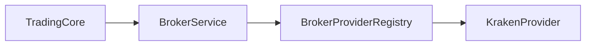

The registry resolves the appropriate provider according to the requested broker.

Trading Core never references provider implementations directly.

---

## Optional Capability Support

Not every provider must implement every capability.

Example:

```text
PaperTradingProvider

├── ExecutionCapability
├── AccountCapability
```

A lightweight provider should not be forced to implement unsupported functionality.

The capability model naturally supports this evolution.

---

## Provider Independence

Each provider owns:

- its capabilities;
- its DTOs;
- its mappers;
- its authentication implementation;
- its error translators.

No implementation detail is shared across providers unless it is genuinely broker-independent.

---

## Market Metadata

The Broker Service does **not** own instrument definitions.

Responsibilities such as:

- tick size;
- lot size;
- price precision;
- quantity precision;
- instrument metadata;
- trading sessions;

belong exclusively to the **Market Data Service**.

The Broker Service consumes already validated execution requests.

This avoids duplication of market knowledge across services.

---

## Design Principles

The capability architecture follows several SOLID principles.

### Single Responsibility Principle

Each capability owns one technical concern.

---

### Interface Segregation Principle

Providers implement only the capabilities they support.

---

### Dependency Inversion Principle

The Broker Service depends on capability abstractions rather than concrete provider implementations.

---

## Benefits

This architecture provides:

- modular provider implementations;
- simplified maintenance;
- reduced coupling;
- easier testing;
- independent capability evolution;
- straightforward onboarding of new brokers.

It also prevents provider implementations from becoming large monolithic classes.

---

## Consequences

### Positive

- Small focused components.
- Better separation of responsibilities.
- Easier provider evolution.
- Improved testability.
- Cleaner dependency graph.
- Better long-term maintainability.

### Negative

- Larger number of classes.
- Slightly more dependency injection wiring.
- Additional composition layer.

These trade-offs are acceptable given the significant gains in modularity.

---

## Related Decisions

This decision is complemented by:

- **Decision 1 — Broker Service Responsibilities**
- **Decision 4 — Authentication Architecture**
- **Decision 5 — Provider Mapping Strategy**
- **Decision 12 — Extensibility & Future Evolution**


# Decision 4 — Authentication Architecture

## Status

**Accepted**

---

## Decision

Authentication is a dedicated technical responsibility of the Broker Service.

Every provider implements its own authentication mechanism through a specialized `AuthenticationCapability`.

Neither the Trading Core nor the other Broker Service capabilities are aware of authentication details.

Authentication is therefore fully encapsulated within the provider implementation.

---

## Rationale

Every broker exposes its own authentication mechanism.

Common differences include:

- API key formats;
- secret management;
- request signatures;
- timestamp requirements;
- nonce generation;
- authentication headers;
- OAuth-based authentication;
- session tokens.

Embedding these concerns inside execution or account operations would violate the Single Responsibility Principle and tightly couple business operations to provider-specific security mechanisms.

Authentication is therefore isolated behind a dedicated capability.

---

## Architectural Overview

Authentication is performed before every authenticated broker request.

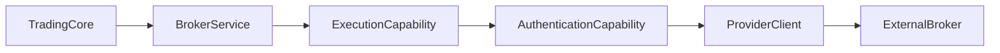

Business capabilities never manipulate credentials directly.

---

## Authentication Capability

Each provider implements its own authentication capability.

Typical responsibilities include:

- loading credentials;
- generating request signatures;
- generating timestamps;
- generating nonces;
- creating authentication headers;
- applying provider-specific security rules.

The capability exposes a simple broker-independent interface while hiding all implementation details.

---

## Credential Management

Credentials are never stored directly inside provider implementations.

Instead, providers obtain credentials through a dedicated abstraction.

```text
CredentialProvider
        │
        ▼
AuthenticationCapability
```

The `CredentialProvider` is responsible for retrieving the credentials required by a broker.

Possible implementations include:

- encrypted configuration;
- secrets manager;
- cloud secret vault;
- hardware security modules.

This abstraction allows credential storage to evolve independently from provider implementations.

---

## Request Signing

Many brokers require cryptographic request signing.

Examples include:

- HMAC signatures;
- SHA-256 hashes;
- RSA signatures;
- provider-specific algorithms.

To avoid duplicating cryptographic logic, signing is delegated to a dedicated component.

```text
AuthenticationCapability
        │
        ▼
Signer
        │
        ▼
Signed Request
```

Each provider selects the signer appropriate for its API.

---

## Authentication Flow

A typical authenticated request follows the sequence below.

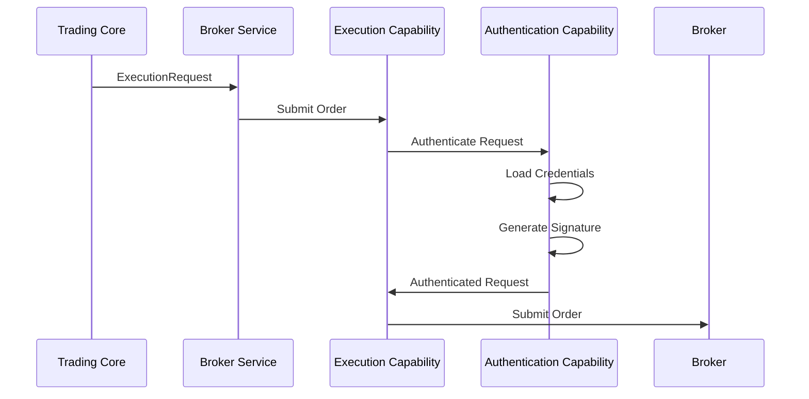

Authentication always occurs before communication with the external broker.

---

## Security Boundaries

Authentication information never crosses the Broker Service boundary.

The Trading Core must never have access to:

- API keys;
- secrets;
- signatures;
- authentication headers;
- provider tokens;
- private certificates.

Only broker-neutral requests are exchanged between services.

---

## Secret Handling

Sensitive information must never:

- appear in logs;
- appear in metrics;
- appear in distributed traces;
- be serialized in exceptions;
- be exposed through monitoring endpoints.

Secrets remain confined to the authentication layer.

---

## Authentication Errors

Authentication failures are translated into broker-neutral exceptions.

Examples include:

```text
Invalid API Key
        ↓
AuthenticationException
```

```text
Expired Token
        ↓
AuthenticationException
```

```text
Invalid Signature
        ↓
AuthenticationException
```

The Trading Core never interprets provider-specific authentication errors.

---

## Token Lifecycle

For providers using temporary credentials, the authentication capability is responsible for:

- token acquisition;
- token refresh;
- token expiration detection;
- secure token storage.

Business capabilities remain completely unaware of token management.

---

## Design Principles

The authentication architecture follows these principles:

- authentication is provider-specific;
- authentication is fully encapsulated;
- credentials never leave the Broker Service;
- cryptographic logic is reusable;
- security concerns remain isolated from business communication.

---

## Consequences

### Positive

- Strong isolation of sensitive information.
- Simplified provider implementations.
- Reusable signing mechanisms.
- Easier credential management.
- Improved security posture.
- Cleaner separation of concerns.

### Negative

- Additional authentication components.
- More dependency injection wiring.
- Slightly more complex provider initialization.

These trade-offs are considered acceptable given the security and maintainability benefits.

---

## Related Decisions

This decision is complemented by:

- **Decision 1 — Broker Service Responsibilities**
- **Decision 3 — Capability-Oriented Provider Architecture**
- **Decision 5 — Provider Mapping Strategy**
- **Decision 6 — Error Translation Strategy**


# Decision 5 — Provider Mapping Strategy

## Status

**Accepted**

---

## Decision

Every broker provider is responsible for translating between broker-neutral contracts and provider-specific models through dedicated mapping components.

Mapping is a first-class architectural concern of the Broker Service.

Business services never manipulate provider-specific DTOs directly.

Likewise, provider implementations never expose their internal models outside the Broker Service.

---

## Rationale

Every broker exposes its own API model.

Differences commonly include:

- request payload structures;
- response payload structures;
- identifier formats;
- timestamps;
- decimal precision;
- enumerations;
- order status values;
- execution reports.

Without a dedicated mapping layer, provider-specific concepts would leak into the Trading Core, tightly coupling business logic to external APIs.

The mapping layer acts as an **Anti-Corruption Layer (ACL)**, preserving the integrity of the Trading OS domain model.

---

## Architectural Overview

Mappings occur in both directions.

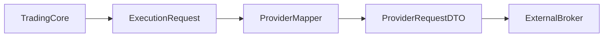

The response follows the reverse path.

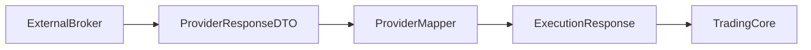

At no point does the Trading Core interact with provider-specific DTOs.

---

## Mapping Responsibilities

Each provider mapper is responsible for:

- converting broker-neutral commands into provider requests;
- converting provider responses into broker-neutral responses;
- translating provider identifiers;
- converting provider timestamps;
- converting numerical representations;
- translating provider enumerations;
- normalizing provider-specific concepts.

Mappers perform **pure transformations**.

They contain no business logic.

---

## Bidirectional Mapping

Every provider mapping must support both directions.

### Outbound Mapping

```text
ExecutionRequest
        │
        ▼
KrakenExecutionRequest
```

Transforms a broker-neutral command into the provider request format.

---

### Inbound Mapping

```text
KrakenExecutionResponse
        │
        ▼
ExecutionResponse
```

Transforms the provider response into a broker-neutral contract.

---

## Provider Isolation

Each provider owns its own mapping implementation.

Example structure:

```text
KrakenProvider
├── KrakenExecutionMapper
├── KrakenAccountMapper
├── KrakenPositionMapper
├── KrakenOrderMapper
```

Another provider implements its own independent mapping components.

No mapper should contain logic for multiple providers.

---

## Mapping Scope

Mappings include only technical transformations.

Typical examples include:

- field renaming;
- enum conversion;
- identifier conversion;
- timestamp conversion;
- decimal normalization;
- collection transformation.

Mappings must **never** perform:

- risk validation;
- execution authorization;
- business calculations;
- portfolio analysis;
- strategy decisions.

---

## Identifier Translation

External brokers frequently use provider-specific identifiers.

The mapping layer translates them into broker-neutral identifiers whenever appropriate.

Example:

```text
Kraken Order ID
        │
        ▼
BrokerOrderId
```

The Trading Core remains independent of provider identifier formats.

---

## Enumeration Translation

Provider-specific enumerations are normalized.

Example:

```text
Kraken "buy"
        │
        ▼
Side.BUY
```

```text
Kraken "sell"
        │
        ▼
Side.SELL
```

The Trading Core never depends on provider enum definitions.

---

## Timestamp Normalization

Providers expose timestamps using different formats.

Examples include:

- UNIX epoch;
- milliseconds;
- ISO-8601 strings;
- custom formats.

Every mapper converts provider timestamps into the standard representation adopted by Trading OS.

---

## Decimal Normalization

Providers often use different numeric representations.

Examples include:

- strings;
- floating-point values;
- arbitrary precision decimals.

Mappings normalize these values into the domain's preferred types before exposing them to the Trading Core.

---

## Mapper Purity

Provider mappers should behave as pure functions.

Given the same input, a mapper must always produce the same output.

Mappers should therefore:

- avoid mutable state;
- avoid network communication;
- avoid database access;
- avoid side effects.

This significantly improves testability.

---

## Error Handling

Mappings should detect malformed provider payloads.

Unexpected payloads are translated into standardized broker-neutral exceptions rather than leaking provider-specific parsing errors.

The Error Translation Strategy (Decision 6) defines the standardized exception hierarchy.

---

## Testing Strategy

Each mapper should be tested independently.

Recommended test categories include:

- valid request mapping;
- valid response mapping;
- enum conversion;
- timestamp conversion;
- numeric conversion;
- malformed payload handling;
- null handling.

Because mappers are pure transformations, unit testing is straightforward and deterministic.

---

## Design Principles

The mapping layer follows these principles:

- provider-specific models remain isolated;
- mappings are deterministic;
- mappings are stateless;
- mappings contain no business logic;
- mappings form the Anti-Corruption Layer between Trading OS and broker APIs.

---

## Consequences

### Positive

- Strong provider isolation.
- Stable public contracts.
- Easier provider replacement.
- Highly testable components.
- Cleaner business model.
- Simplified provider evolution.

### Negative

- Additional mapping classes.
- Slight increase in implementation effort.
- Duplicate field definitions across models.

These trade-offs are accepted because they significantly improve long-term maintainability and preserve the integrity of the domain model.

---

## Related Decisions

This decision is complemented by:

- **Decision 2 — Public Broker-Neutral Contracts**
- **Decision 3 — Capability-Oriented Provider Architecture**
- **Decision 4 — Authentication Architecture**
- **Decision 6 — Error Translation Strategy**


# Decision 6 — Error Translation Strategy

## Status

**Accepted**

---

## Decision

The Broker Service translates every provider-specific failure into a standardized broker-neutral exception hierarchy.

Provider exceptions, HTTP status codes, transport failures and API-specific error payloads are implementation details that remain entirely contained within the Broker Service.

The Trading Core interacts exclusively with broker-neutral exceptions.

---

## Rationale

Every broker reports failures differently.

Examples include:

- proprietary error codes;
- HTTP status codes;
- JSON error payloads;
- SDK exceptions;
- transport exceptions;
- timeout exceptions;
- authentication failures.

Allowing these failures to propagate into the Trading Core would couple business logic to provider implementations and make multi-broker support significantly more difficult.

Instead, the Broker Service translates every technical failure into a stable exception model understood by the rest of Trading OS.

This translation forms part of the Anti-Corruption Layer between the domain and external broker APIs.

---

## Architectural Overview

Every provider implements an `ErrorTranslator` responsible for converting provider failures into standardized exceptions.

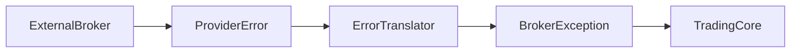

The Trading Core never receives provider-specific exceptions.

---

## Translation Responsibilities

The Error Translator is responsible for:

- translating provider error payloads;
- translating provider SDK exceptions;
- translating HTTP status codes;
- translating transport failures;
- translating authentication failures;
- translating rate-limit responses;
- preserving useful diagnostic information.

It does **not** decide how the Trading Core should react.

---

## Standard Exception Hierarchy

The Broker Service exposes a broker-neutral exception hierarchy.

Typical exceptions include:

```text
BrokerException
│
├── AuthenticationException
├── AuthorizationException
├── InvalidOrderException
├── OrderNotFoundException
├── InsufficientFundsException
├── RateLimitException
├── TemporaryBrokerException
├── BrokerUnavailableException
└── UnknownBrokerException
```

The hierarchy represents technical outcomes only.

Business interpretation belongs to the Execution Domain.

---

## Authentication Failures

Authentication-related failures are translated into a common exception.

Examples include:

```text
Invalid API Key
Expired Token
Invalid Signature

        ↓

AuthenticationException
```

The Trading Core remains independent of provider authentication models.

---

## Authorization Failures

Requests rejected because of missing permissions or insufficient account privileges are translated into:

```text
AuthorizationException
```

Provider-specific permission models remain internal.

---

## Validation Failures

Provider-side validation errors are normalized.

Examples include:

- invalid quantity;
- invalid price;
- unsupported order type;
- malformed request.

These failures become:

```text
InvalidOrderException
```

Business validation remains the responsibility of the Trading Core.

---

## Insufficient Funds

Broker-specific messages such as:

```text
Insufficient Balance
Not Enough Margin
Balance Too Low
```

are translated into:

```text
InsufficientFundsException
```

The Trading Core therefore reacts to a stable exception regardless of the broker.

---

## Missing Orders

Provider-specific "order not found" responses become:

```text
OrderNotFoundException
```

The original provider payload remains available for diagnostics but never escapes the Broker Service boundary.

---

## Rate Limiting

Broker APIs frequently enforce request quotas.

Typical responses include:

- HTTP 429;
- custom rate-limit payloads;
- provider-specific throttling codes.

All such failures are translated into:

```text
RateLimitException
```

Retry scheduling remains a business decision owned by the Execution Domain.

---

## Temporary Failures

Transient communication problems include:

- socket timeout;
- connection reset;
- gateway timeout;
- temporary provider outage.

These are translated into:

```text
TemporaryBrokerException
```

This exception indicates that the technical communication failed but does not imply any business outcome.

---

## Broker Unavailability

Provider-wide outages are translated into:

```text
BrokerUnavailableException
```

Typical causes include:

- maintenance windows;
- unavailable APIs;
- infrastructure outages;
- unavailable gateways.

The Broker Service reports facts only.

---

## Unknown Failures

Unexpected provider responses are translated into:

```text
UnknownBrokerException
```

This prevents provider-specific implementation details from leaking into the application.

Unexpected failures should always be logged with sufficient diagnostic information for operational analysis.

---

## Preserving Diagnostic Information

While provider-specific exceptions are hidden from the Trading Core, useful diagnostic context should be preserved internally.

Examples include:

- provider error code;
- HTTP status;
- request identifier;
- correlation identifier;
- provider message;
- raw payload (when safe).

This information supports troubleshooting without exposing provider-specific concepts to business code.

---

## Error Translation Flow

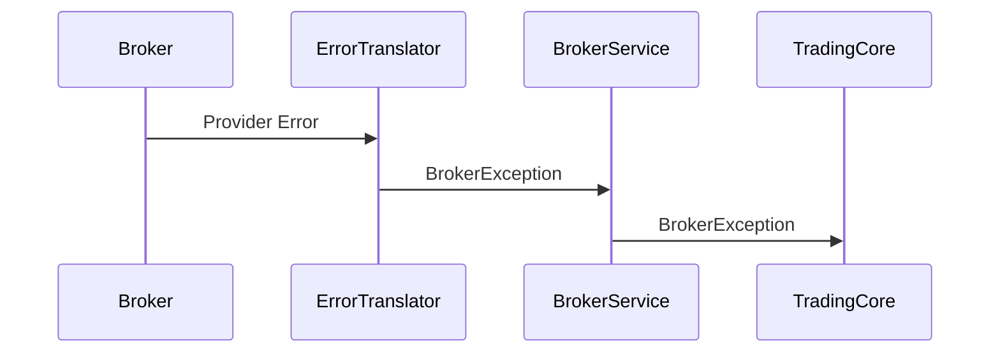

Every provider follows the same translation process.

---

## Design Principles

The error translation layer follows these principles:

- provider failures remain isolated;
- exception hierarchy is broker-neutral;
- business code never depends on provider errors;
- diagnostic information is preserved internally;
- translation is deterministic and consistent across providers.

---

## Consequences

### Positive

- Stable error model across all brokers.
- Strong separation between business and infrastructure.
- Easier provider replacement.
- Simplified business logic.
- Improved testability.
- Consistent error handling throughout Trading OS.

### Negative

- Additional translation components.
- Maintenance of a standardized exception hierarchy.
- Some provider-specific details require explicit diagnostic logging.

These trade-offs are accepted because they significantly improve maintainability and preserve the independence of the Trading Core.

---

## Related Decisions

This decision is complemented by:

- **Decision 4 — Authentication Architecture**
- **Decision 5 — Provider Mapping Strategy**
- **Decision 7 — Resilience Strategy**
- **ADR-029 — Execution Domain**


# Decision 7 — Resilience Strategy

## Status

**Accepted**

---

## Decision

The Broker Service is responsible exclusively for **technical resilience**.

It protects communication with external brokers against infrastructure failures while remaining completely independent from business decision-making.

Business resilience—including retries, reconciliation strategies and execution recovery—is owned exclusively by the **Execution Domain**, as defined in ADR-029.

---

## Rationale

Communication with external brokers is inherently unreliable.

Failures may include:

- network interruptions;
- connection timeouts;
- provider outages;
- gateway failures;
- transient infrastructure failures;
- rate limiting;
- degraded broker services.

The Broker Service must shield Trading OS from these technical issues.

However, it cannot determine the business implications of a communication failure.

For example, after a timeout during an order submission, the Broker Service cannot know whether:

- the request never reached the broker;
- the broker received the request but failed to reply;
- the order was successfully executed but the response was lost.

Automatically retrying such an operation could therefore create duplicate executions.

Only the Execution Domain possesses sufficient business context to determine the correct recovery strategy.

---

## Scope of Responsibility

The Broker Service owns technical resilience mechanisms, including:

- communication timeouts;
- circuit breakers;
- bulkheads;
- provider-specific rate limiting;
- provider health monitoring;
- detection of transport failures;
- safe retries for read-only operations.

These mechanisms improve communication reliability without introducing business behaviour.

---

## Out of Scope

The Broker Service is **not responsible** for:

- deciding whether an execution should be retried;
- determining whether reconciliation is required;
- recovering failed executions;
- interpreting unknown execution outcomes;
- changing execution state;
- publishing recovery events.

These responsibilities remain entirely within the Execution Domain.

---

## Timeout Management

Every outbound broker request must be bounded by configurable communication timeouts.

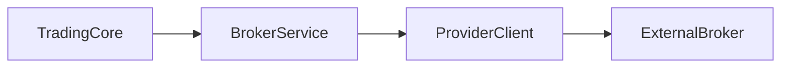

If the timeout expires before a response is received, the Provider Client reports a technical communication failure.

The Error Translator converts the failure into an appropriate broker-neutral exception.

Example:

```text
SocketTimeoutException
        │
        ▼
TemporaryBrokerException
```

Timeouts communicate technical uncertainty only.

They never imply business failure.

---

## Circuit Breakers

Every provider communication is protected by a Circuit Breaker.

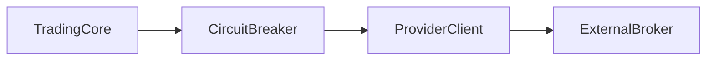

Circuit Breakers prevent cascading failures by:

- failing fast during broker outages;
- protecting thread pools;
- preventing resource exhaustion;
- allowing automatic recovery once the provider becomes healthy again.

Circuit Breakers are infrastructure concerns only.

They never alter business behaviour.

---

## Bulkheads

Communication resources should be isolated between providers.

Example:

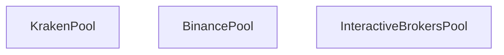

A degraded provider must never consume all available communication resources.

Each provider operates within its own isolated execution pool.

---

## Retry Policy

Retries are classified into two categories.

### Unsafe Operations

Operations capable of modifying broker state must **never** be retried automatically.

Examples include:

- order submission;
- order cancellation;
- order modification.

These operations are not guaranteed to be idempotent.

Automatic retries could create duplicate executions or inconsistent broker state.

---

### Safe Operations

Read-only operations may be retried transparently.

Examples include:

- account retrieval;
- balance retrieval;
- position retrieval;
- order lookup.

These operations do not modify broker state and therefore present minimal risk.

Retry policies remain configurable according to provider characteristics.

---

## Rate Limiting

Broker APIs commonly enforce request quotas.

The Broker Service is responsible for:

- respecting provider quotas;
- detecting rate-limit responses;
- delaying requests when appropriate;
- translating provider-specific throttling into standardized exceptions.

Example:

```text
HTTP 429
        │
        ▼
RateLimitException
```

Scheduling subsequent retries remains a business decision.

---

## Provider Health

Each provider exposes a standardized technical health status.

Typical values include:

- AVAILABLE
- DEGRADED
- UNAVAILABLE

These indicators support operational monitoring and alerting.

They never directly influence execution decisions.

---

## Idempotency Support

Some providers support idempotent request identifiers such as:

- `clientOrderId`
- `clientRequestId`

The Broker Service forwards these identifiers whenever supported.

However, business-level idempotency remains the responsibility of the Execution Domain.

The Broker Service simply transports provider-supported identifiers.

---

## Failure Classification

The Broker Service classifies failures according to their technical nature.

Typical categories include:

- communication failures;
- authentication failures;
- authorization failures;
- provider validation failures;
- provider outages;
- transport failures;
- rate limiting.

Business interpretation is intentionally excluded from this classification.

---

## Design Principles

The resilience architecture follows these principles:

- resilience is a technical concern;
- infrastructure reports facts;
- business decides consequences;
- communication failures never imply business outcomes;
- retry decisions require business context;
- technical protection remains transparent to the Trading Core.

---

## Consequences

### Positive

- Clear separation between technical and business resilience.
- Reduced risk of duplicate executions.
- Improved system stability.
- Better fault isolation.
- Provider failures remain localized.
- Predictable communication behaviour.

### Negative

- Recovery logic becomes more sophisticated within the Execution Domain.
- Additional infrastructure components increase implementation complexity.
- Two resilience layers (technical and business) must remain clearly separated.

These trade-offs are accepted because they preserve the integrity of the execution lifecycle while ensuring robust communication with external brokers.

---

## Related Decisions

This decision is complemented by:

- **Decision 6 — Error Translation Strategy**
- **Decision 8 — Observability Strategy**
- **Decision 9 — Broker Service as a Synchronous Technical Adapter**
- **ADR-029 — Execution Domain**


# Decision 8 — Observability Strategy

## Status

**Accepted**

---

## Decision

The Broker Service provides comprehensive **technical observability** to ensure that all interactions with external brokers are traceable, measurable and diagnosable.

Observability is considered a first-class architectural concern.

Its purpose is to provide operational visibility into broker communications without introducing business logic or influencing business decisions.

---

## Rationale

External broker APIs are outside the control of Trading OS.

Communication issues may originate from:

- broker outages;
- network failures;
- authentication problems;
- provider latency;
- infrastructure degradation;
- unexpected API behaviour.

Without comprehensive observability, diagnosing production incidents becomes difficult and expensive.

The Broker Service must therefore expose sufficient operational information to:

- troubleshoot failures;
- monitor provider health;
- analyze performance;
- support production incidents;
- identify infrastructure bottlenecks.

Business analytics remain outside the scope of the Broker Service.

---

## Observability Pillars

The Broker Service implements three complementary observability mechanisms.

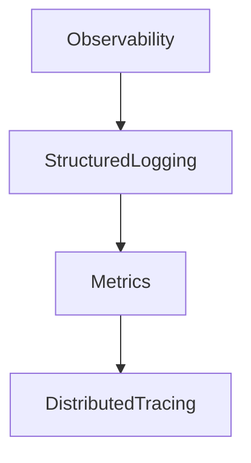

Each mechanism provides a different perspective on the behaviour of the service.

---

## Structured Logging

Every significant provider interaction generates structured log entries.

Typical log information includes:

- provider identifier;
- operation type;
- request identifier;
- correlation identifier;
- execution duration;
- communication result;
- translated exception type.

Logs should be emitted in a structured format suitable for centralized log aggregation systems.

---

## Logging Principles

Logging should prioritize useful operational information while avoiding unnecessary verbosity.

Logs should:

- be structured;
- be machine-readable;
- include correlation identifiers;
- include execution duration;
- include provider information.

Logs should never expose confidential information.

---

## Sensitive Information

The following information must never appear in logs:

- API keys;
- secrets;
- authentication tokens;
- request signatures;
- private certificates;
- confidential provider payloads;
- personally identifiable information (PII).

Sensitive values should be either omitted or masked before logging.

---

## Correlation IDs

Every request flowing through the Broker Service propagates a unique Correlation ID.

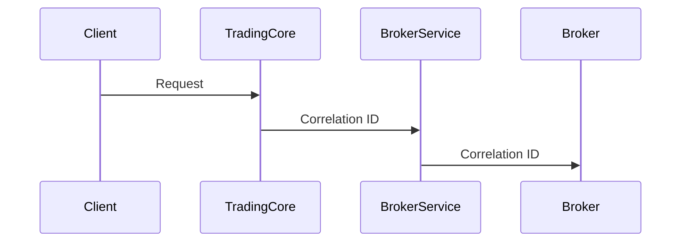

The Correlation ID allows a complete request lifecycle to be reconstructed across multiple services.

It should appear consistently in:

- logs;
- traces;
- metrics;
- exception reports.

---

## Distributed Tracing

The Broker Service participates in distributed tracing across Trading OS.

Each provider interaction creates dedicated tracing spans.

Typical spans include:

- provider resolution;
- authentication;
- request mapping;
- outbound communication;
- response mapping;
- error translation.

Tracing enables precise latency analysis across service boundaries.

---

## Metrics

The Broker Service exposes technical metrics suitable for monitoring dashboards and alerting systems.

Recommended metrics include:

### Request Metrics

- request count;
- request duration;
- request success rate;
- request failure rate.

---

### Provider Metrics

- provider latency;
- provider availability;
- provider timeout count;
- provider error count;
- provider rate-limit count.

---

### Infrastructure Metrics

- circuit breaker state;
- retry count for safe operations;
- connection pool usage;
- active requests;
- thread pool utilization.

---

### Error Metrics

Metrics should classify failures by standardized broker-neutral exception type.

Examples include:

- AuthenticationException;
- TemporaryBrokerException;
- RateLimitException;
- BrokerUnavailableException.

This enables consistent monitoring independently of provider-specific error models.

---

## Technical Audit Trail

The Broker Service maintains a technical audit trail of communication events.

Typical audit entries include:

- request sent;
- response received;
- timeout detected;
- provider rejection;
- authentication failure;
- communication duration.

This audit trail supports diagnostics and incident investigations.

It is **not** a business audit log.

---

## Business Audit Separation

Business audit information remains the responsibility of the Trading Core.

Examples of business events include:

- execution submitted;
- execution rejected;
- execution recovered;
- execution completed;
- execution cancelled.

The Broker Service records technical communication only.

---

## Health Indicators

Each provider exposes standardized health information.

Typical provider states include:

- AVAILABLE;
- DEGRADED;
- UNAVAILABLE.

Health indicators support:

- monitoring dashboards;
- operational alerts;
- infrastructure diagnostics.

They must never directly influence business decisions.

---

## Monitoring Integration

The Broker Service should integrate with standard observability platforms such as:

- OpenTelemetry;
- Prometheus;
- Grafana;
- centralized log aggregation systems.

Concrete technologies remain implementation details and may evolve independently.

---

## Alerting

Operational alerts should be generated for situations including:

- repeated authentication failures;
- provider unavailability;
- elevated timeout rates;
- excessive provider latency;
- sustained rate limiting;
- circuit breaker activation.

Alerts are intended for operational teams and automated monitoring systems.

They do not modify business behaviour.

---

## Design Principles

The observability architecture follows these principles:

- observability is infrastructure, not business;
- technical events are observable;
- business interpretation remains external;
- all requests are traceable;
- metrics are standardized;
- provider implementations remain transparent to monitoring tools.

---

## Consequences

### Positive

- Improved production diagnostics.
- Complete request traceability.
- Better operational visibility.
- Faster incident resolution.
- Consistent monitoring across providers.
- Easier performance analysis.

### Negative

- Additional infrastructure configuration.
- Increased telemetry volume.
- Slight runtime overhead due to instrumentation.

These trade-offs are accepted because operational visibility is essential for a reliable broker integration platform.

---

## Related Decisions

This decision is complemented by:

- **Decision 6 — Error Translation Strategy**
- **Decision 7 — Resilience Strategy**
- **Decision 9 — Broker Service as a Synchronous Technical Adapter**
- **Decision 10 — Trading Core Communication**


# Decision 9 — Broker Service as a Synchronous Technical Adapter

## Status

**Accepted**

---

## Decision

The Broker Service acts as a **synchronous technical adapter** between the Trading Core and external broker APIs.

Its responsibility is to execute broker requests, translate provider-specific models and return standardized broker-neutral responses.

The Broker Service never orchestrates business workflows, owns execution state or publishes business events.

---

## Rationale

The Broker Service exists to abstract external broker APIs.

Its purpose is to answer a simple technical question:

> "What did the broker report?"

It must **never** answer business questions such as:

- Should this execution be retried?
- Has the execution failed?
- Is reconciliation required?
- Should a recovery workflow begin?
- Has the execution lifecycle advanced?

Only the Execution Domain has sufficient business context to answer those questions.

Restricting the Broker Service to a synchronous request/response model preserves a clear separation between infrastructure and business logic.

---

## Request Flow

The Broker Service processes requests synchronously.

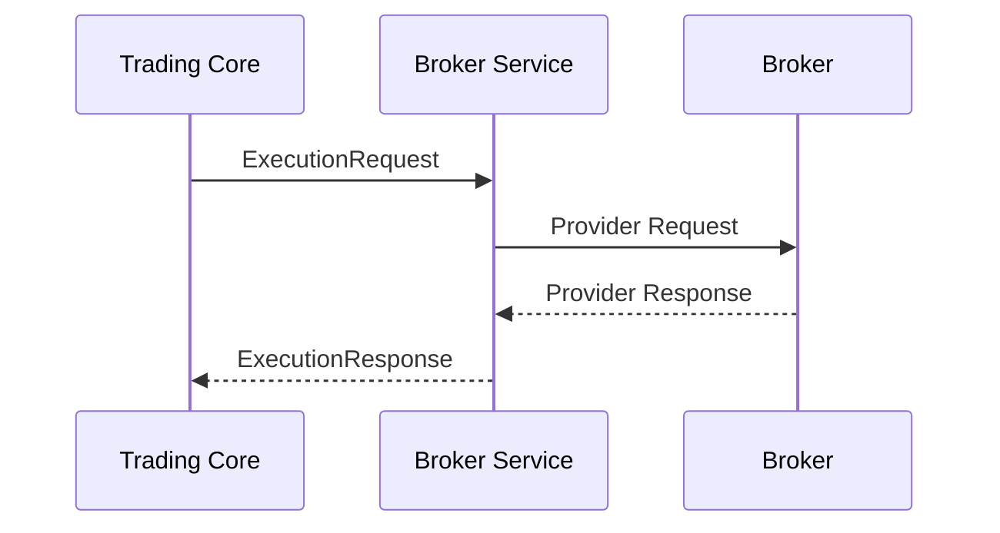

The interaction ends once the broker response has been translated.

No business processing occurs after the response has been returned.

---

## Responsibilities

The Broker Service is responsible for:

- receiving broker-neutral requests;
- selecting the appropriate provider;
- authenticating requests;
- mapping requests;
- communicating with the broker;
- translating responses;
- translating provider errors;
- returning standardized broker-neutral results.

Every responsibility is technical in nature.

---

## Non-Responsibilities

The Broker Service is **not responsible** for:

- execution orchestration;
- workflow management;
- execution state transitions;
- recovery pipelines;
- retry decisions;
- reconciliation decisions;
- business event publication;
- domain state persistence;
- aggregate coordination.

These responsibilities belong exclusively to the Trading Core.

---

## Event Ownership

Business events originate only from business domains.

The Broker Service never publishes events such as:

- `ExecutionSubmitted`
- `ExecutionRejected`
- `ExecutionCompleted`
- `ExecutionCancelled`
- `ExecutionRecovered`
- `ExecutionOutcomeUnknown`

Those events require business interpretation and therefore remain the responsibility of the Execution Domain.

---

## Technical Telemetry

Although the Broker Service does not emit business events, it may produce technical telemetry such as:

- logs;
- metrics;
- distributed traces;
- health indicators.

These artifacts are operational only and never influence business behaviour.

---

## Stateless Processing

Each broker request is processed independently.

The Broker Service does not persist execution state.

Typical request lifecycle:

```mermaid
flowchart LR

    Request

    --> Authentication

    --> Mapping

    --> Provider Communication

    --> Response Mapping

    --> Response
```

Once the response has been returned, no execution context is retained.

---

## Execution Lifecycle Ownership

The complete execution lifecycle remains inside the Execution Domain.

Example:

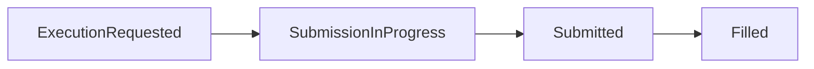

The Broker Service simply reports the broker response.

It never modifies lifecycle state.

---

## Unknown Outcomes

Some broker operations may end with uncertain technical outcomes.

Example:

```text id="s9v2a"
Request Sent
        │
        ▼
Communication Timeout
```

The Broker Service reports the timeout through a standardized exception.

It does **not** determine whether:

- the broker received the request;
- the order exists;
- reconciliation is required.

Those decisions belong to ADR-029.

---

## Synchronous Boundary

The Broker Service exposes a synchronous API.

Communication is request/response based.

Future asynchronous integrations (for example WebSocket streams or FIX sessions) remain internal implementation details.

Regardless of transport protocol, the Broker Service continues to expose a deterministic broker-neutral interface to the Trading Core.

---

## Design Principles

The Broker Service follows these principles:

- infrastructure reports facts;
- business interprets facts;
- communication remains synchronous;
- no business orchestration;
- no business persistence;
- no business events;
- provider-specific concerns remain isolated.

---

## Consequences

### Positive

- Clear separation between infrastructure and business.
- Predictable service behaviour.
- Simplified testing.
- Stateless service implementation.
- Easier provider replacement.
- Consistent communication model.

### Negative

- Business orchestration requires additional coordination in the Trading Core.
- Event publication cannot occur directly from the Broker Service.
- Recovery workflows require an additional business layer.

These trade-offs are accepted because they preserve the architectural boundary between infrastructure and domain logic.

---

## Related Decisions

This decision is complemented by:

- **Decision 1 — Broker Service Responsibilities**
- **Decision 7 — Resilience Strategy**
- **Decision 8 — Observability Strategy**
- **Decision 10 — Trading Core Communication**
- **ADR-029 — Execution Domain**


# Decision 10 — Trading Core Communication

## Status

**Accepted**

---

## Decision

The Trading Core communicates with the Broker Service through a **broker-neutral synchronous API**.

The communication follows the principles of Hexagonal Architecture:

- the Trading Core depends on an abstraction;
- the Broker Service provides the infrastructure implementation;
- all communication uses broker-neutral contracts;
- provider-specific details remain isolated inside the Broker Service.

The Broker Service is considered an external infrastructure dependency from the perspective of the Trading Core.

---

## Rationale

The Trading Core should remain independent from:

- communication protocols;
- REST clients;
- service discovery;
- authentication mechanisms;
- broker implementations;
- provider-specific APIs.

Business code must not know **how** broker communication occurs.

Its only concern is requesting broker operations through a stable application interface.

---

## Architectural Overview

The communication path is illustrated below.

```mermaid
flowchart LR

    ExecutionDomain

    --> BrokerExecutionPort

    --> OpenFeignAdapter

    --> BrokerService

    --> ExternalBroker
```

The Execution Domain communicates only with the `BrokerExecutionPort`.

The OpenFeign adapter is an infrastructure implementation hidden behind this abstraction.

---

## Hexagonal Architecture

The communication follows the Ports and Adapters pattern.

```mermaid
flowchart LR

    subgraph Trading Core

        ExecutionDomain

        BrokerExecutionPort
    end

    subgraph Infrastructure

        OpenFeignAdapter
    end

    subgraph Broker Service

        BrokerController

        Provider
    end

    ExecutionDomain --> BrokerExecutionPort

    BrokerExecutionPort --> OpenFeignAdapter

    OpenFeignAdapter --> BrokerController

    BrokerController --> Provider
```

The dependency direction always points toward abstractions.

---

## Application Port

The Trading Core defines an application port exposing broker operations.

Typical operations include:

- submit execution;
- cancel execution;
- retrieve account;
- retrieve positions;
- retrieve orders;
- reconcile execution.

The port contains no transport-specific concerns.

Example:

```java
public interface BrokerExecutionPort {

    ExecutionResponse submit(ExecutionRequest request);

    CancelResponse cancel(CancelRequest request);

    AccountSnapshot getAccount(AccountId accountId);

}
```

The interface belongs to the Trading Core.

---

## Infrastructure Adapter

The infrastructure layer provides the concrete implementation of the application port.

Example:

```text
BrokerExecutionPort
        │
        ▼
OpenFeignBrokerExecutionAdapter
```

The adapter is responsible for:

- HTTP communication;
- serialization;
- request forwarding;
- response deserialization;
- infrastructure exception propagation.

No business logic belongs here.

---

## Service Discovery

Service discovery is delegated to the infrastructure layer.

Trading Core never references network addresses directly.

Typical deployment:

```mermaid
flowchart LR

    TradingCore

    --> Eureka

    --> BrokerService
```

The infrastructure resolves service locations dynamically.

Business services remain unaware of deployment topology.

---

## Gateway Usage

The API Gateway is intended for **external clients only**.

Internal service-to-service communication bypasses the Gateway.

```mermaid
flowchart LR

    Client

    --> Gateway

    --> TradingCore

    TradingCore

    --> BrokerService
```

This reduces latency and avoids unnecessary infrastructure hops.

---

## Internal REST API

The Broker Service exposes an internal REST API.

Characteristics include:

- broker-neutral contracts;
- synchronous request/response;
- versioned endpoints;
- infrastructure authentication;
- deterministic behaviour.

The API is not intended for public consumption.

---

## Controller Responsibilities

REST controllers are intentionally lightweight.

Their responsibilities include:

- request validation;
- request forwarding;
- response conversion;
- HTTP status generation.

Controllers never contain:

- business logic;
- provider logic;
- orchestration;
- persistence.

As defined by project conventions, every controller returns a `ResponseEntity`.

---

## Security

Inter-service communication is authenticated using JWT.

Each internal request carries a valid service token.

The Broker Service validates the token before processing the request.

Provider credentials remain completely independent from JWT authentication.

Two security layers therefore coexist:

- service authentication (JWT);
- broker authentication (API keys, signatures, OAuth, etc.).

These responsibilities must never be mixed.

---

## Timeouts

Communication timeouts exist at two independent levels.

### Service Communication

```text
Trading Core
        │
        ▼
Broker Service
```

Protects internal service communication.

---

### Provider Communication

```text
Broker Service
        │
        ▼
External Broker
```

Protects communication with external providers.

Each timeout is configured independently.

This prevents infrastructure failures from propagating across architectural boundaries.

---

## Error Propagation

Communication failures follow a deterministic path.

```mermaid
sequenceDiagram

    participant TC as Trading Core
    participant Adapter
    participant BS as Broker Service
    participant Broker

    TC->>Adapter: ExecutionRequest
    Adapter->>BS: HTTP Request
    BS->>Broker: Provider Request
    Broker-->>BS: Provider Error
    BS-->>Adapter: BrokerException
    Adapter-->>TC: BrokerException
```

The Trading Core receives only broker-neutral exceptions.

---

## API Versioning

Internal APIs evolve through explicit versioning.

Breaking changes require:

- new endpoint versions;
- backward compatibility during migration;
- coordinated deployment between services.

This enables independent service evolution while preserving compatibility.

---

## Design Principles

Communication between Trading Core and Broker Service follows these principles:

- broker-neutral contracts only;
- dependency inversion;
- synchronous communication;
- lightweight controllers;
- infrastructure hidden behind ports;
- internal APIs are versioned;
- deployment details remain outside business logic.

---

## Consequences

### Positive

- Strong architectural decoupling.
- Stable service contracts.
- Independent deployment of services.
- Simplified testing through port abstractions.
- Infrastructure technologies remain replaceable.
- Clear ownership boundaries.

### Negative

- Additional infrastructure layer.
- Network latency between services.
- More interfaces and adapters to maintain.

These trade-offs are accepted because they preserve the long-term maintainability and scalability of the Trading OS architecture.

---

## Related Decisions

This decision is complemented by:

- **Decision 2 — Public Broker-Neutral Contracts**
- **Decision 7 — Resilience Strategy**
- **Decision 9 — Broker Service as a Synchronous Technical Adapter**
- **Decision 11 — Testing Strategy**
- **ADR-001 — Trading OS Vision and Product Philosophy**


# Decision 11 — Testing Strategy

## Status

**Accepted**

---

## Decision

The Broker Service adopts a **multi-layered testing strategy** designed to verify each architectural layer independently while ensuring reliable end-to-end integration.

Testing is considered an integral part of the architecture rather than a post-development activity.

The strategy prioritizes:

- deterministic execution;
- fast feedback;
- provider isolation;
- reproducible results;
- confidence during refactoring.

---

## Rationale

The Broker Service integrates with external systems that are:

- unavailable during development;
- rate limited;
- non-deterministic;
- occasionally unstable;
- outside the control of Trading OS.

Depending directly on real brokers for automated testing would lead to:

- flaky test suites;
- slow CI pipelines;
- unpredictable failures;
- limited test coverage.

Instead, each architectural layer is tested independently using the most appropriate strategy.

---

# Testing Pyramid

The Broker Service follows a classical testing pyramid.

```mermaid
graph TD

    E2E["End-to-End Tests"]

    Contract["Contract Tests"]

    Integration["Integration Tests"]

    Unit["Unit Tests"]

    E2E --> Contract
    Contract --> Integration
    Integration --> Unit
```

The majority of tests should be unit tests.

Higher-level tests become progressively fewer and more focused.

---

# Unit Tests

## Scope

Unit tests validate isolated components without external dependencies.

Typical candidates include:

- provider mappers;
- authentication components;
- error translators;
- capability implementations;
- utility classes;
- validators.

Dependencies should be mocked whenever appropriate.

---

## Characteristics

Unit tests should be:

- deterministic;
- independent;
- fast;
- isolated;
- repeatable.

A unit test must never require:

- network access;
- databases;
- external brokers.

---

## Example Components

Typical unit-tested classes include:

```text
KrakenExecutionMapper

AuthenticationCapability

ErrorTranslator

ProviderRegistry

ExecutionCapability
```

Each component should be tested independently.

---

# Integration Tests

## Scope

Integration tests validate collaboration between Broker Service components.

Examples include:

- REST controllers;
- provider wiring;
- dependency injection;
- serialization;
- authentication flow;
- provider configuration.

These tests verify that components function correctly together.

---

## External Communication

Integration tests must **not** communicate with real brokers.

Instead, provider APIs are simulated using mock HTTP servers.

Recommended tools include:

- WireMock;
- MockWebServer.

---

# Contract Tests

## Purpose

Contract tests validate compatibility between:

- Trading Core;
- Broker Service.

The goal is to ensure that public broker-neutral contracts remain stable.

Typical validation includes:

- request structure;
- response structure;
- serialization;
- backward compatibility;
- endpoint behavior.

Contract tests protect independently deployable services from incompatible API changes.

---

# Provider Tests

Each provider implementation should have its own dedicated test suite.

Typical scenarios include:

- authentication;
- request mapping;
- response mapping;
- error translation;
- provider configuration;
- provider-specific edge cases.

Provider tests remain isolated from other providers.

---

# End-to-End Tests

End-to-End tests validate complete execution flows across multiple services.

Typical flow:

```mermaid
sequenceDiagram

    participant TradingCore
    participant BrokerService
    participant MockBroker

    TradingCore->>BrokerService: ExecutionRequest
    BrokerService->>MockBroker: Provider Request
    MockBroker-->>BrokerService: Provider Response
    BrokerService-->>TradingCore: ExecutionResponse
```

End-to-End tests verify that the entire integration pipeline behaves correctly.

---

# Sandbox Testing

Some brokers provide sandbox environments.

These environments may be used for:

- manual validation;
- exploratory testing;
- provider compatibility verification.

Sandbox environments should **not** be required for automated CI pipelines because:

- availability cannot be guaranteed;
- behavior may differ from production;
- execution speed is limited.

---

# CI/CD Requirements

Every automated build should execute:

- unit tests;
- integration tests;
- contract tests.

End-to-End tests may execute separately depending on deployment strategy.

A successful build requires all mandatory test suites to pass.

---

# Mock Broker Strategy

A mock broker represents the expected provider behavior.

Example:

```mermaid
flowchart LR

    BrokerService

    --> MockBroker
```

The mock broker should simulate:

- successful executions;
- authentication failures;
- timeouts;
- rate limiting;
- malformed payloads;
- provider outages.

This enables deterministic testing of exceptional scenarios.

---

# Performance Testing

Performance tests verify that the Broker Service behaves correctly under realistic load.

Typical measurements include:

- request latency;
- throughput;
- concurrent request handling;
- connection pool behavior;
- circuit breaker activation.

Performance tests remain independent from functional correctness tests.

---

# Resilience Testing

Dedicated resilience tests validate:

- timeout handling;
- circuit breaker behavior;
- retry policies for read operations;
- provider outages;
- degraded network conditions.

These tests verify infrastructure resilience independently from business logic.

---

# Regression Testing

Whenever a provider bug is fixed, a regression test should be added.

The regression suite protects against reintroducing previously resolved issues.

Regression tests are considered permanent.

---

# Test Data

Test data should be:

- deterministic;
- minimal;
- representative;
- reusable.

Provider-specific payloads should be stored separately for each provider.

Business fixtures should remain broker-neutral whenever possible.

---

# Design Principles

The testing strategy follows these principles:

- test behavior, not implementation;
- isolate external dependencies;
- prefer deterministic execution;
- maximize automation;
- verify each architectural layer independently;
- preserve provider independence.

---

# Consequences

## Positive

- Reliable CI pipelines.
- Fast developer feedback.
- High confidence during refactoring.
- Provider independence.
- Excellent regression protection.
- Stable service contracts.

## Negative

- Larger test codebase.
- Additional maintenance effort.
- Mock infrastructure requires continuous updates.

These trade-offs are accepted because automated testing is essential for maintaining a reliable broker integration platform.

---

# Related Decisions

This decision is complemented by:

- **Decision 5 — Provider Mapping Strategy**
- **Decision 6 — Error Translation Strategy**
- **Decision 7 — Resilience Strategy**
- **Decision 10 — Trading Core Communication**
- **Decision 12 — Extensibility & Future Evolution**


# Decision 12 — Extensibility & Future Evolution

## Status

**Accepted**

---

## Decision

The Broker Service shall be designed as an **extensible integration platform** rather than a collection of broker-specific implementations.

The architecture must allow new providers, communication protocols and technical capabilities to be added through extension rather than modification.

Future evolution must preserve the existing architectural boundaries and public contracts.

---

## Rationale

Trading OS is intended to support multiple brokers over its lifetime.

New providers will inevitably introduce:

- different authentication models;
- new communication protocols;
- additional order types;
- new account models;
- streaming APIs;
- protocol evolution.

The architecture must therefore avoid assumptions that only fit the initial provider (Kraken).

Instead, it should establish stable extension points that minimize the impact of future integrations.

This follows the **Open/Closed Principle**:

> The Broker Service should be open for extension but closed for modification.

---

# Extension Strategy

New functionality should be introduced by adding new implementations rather than modifying existing ones.

Typical examples include:

- adding a new broker provider;
- introducing a new authentication mechanism;
- supporting a new transport protocol;
- adding a new capability.

Existing providers should remain unaffected whenever possible.

---

# Provider Extensibility

Adding a new broker should primarily involve creating a new provider package.

Example:

```text
providers/

├── kraken/
│
├── binance/
│
├── interactivebrokers/
│
└── oanda/
```

Each provider owns its own:

- capabilities;
- mappers;
- DTOs;
- authentication;
- error translators;
- configuration.

No existing provider should require modification.

---

# Capability Evolution

New technical capabilities may be introduced over time.

Examples include:

- MarketDataStreamingCapability
- WebSocketCapability
- FixProtocolCapability
- PortfolioCapability
- FundingCapability

Capabilities should remain small, cohesive and independent.

Providers implement only the capabilities they support.

---

# Communication Protocol Evolution

The public architecture is independent of transport protocol.

Current communication may use REST.

Future implementations may additionally support:

- WebSocket;
- FIX;
- gRPC;
- proprietary broker protocols.

Regardless of transport technology, the Broker Service continues to expose broker-neutral application contracts.

---

# Public Contract Stability

Broker-neutral contracts are intentionally stable.

Future provider evolution must not require changes to:

- Trading Core;
- Execution Domain;
- Risk Engine;
- Analytics;
- AI Engine.

Changes should remain localized inside provider implementations whenever possible.

Breaking changes require explicit API versioning.

---

# Configuration Extensibility

Provider configuration should remain externalized.

Typical configuration includes:

- endpoints;
- authentication parameters;
- timeout values;
- retry policies for read operations;
- rate limits;
- provider-specific options.

Configuration should be replaceable without recompiling the application.

---

# Technology Independence

The architecture intentionally avoids dependence on specific technologies.

Examples include:

- HTTP client implementations;
- dependency injection frameworks;
- serialization libraries;
- resilience libraries;
- observability platforms.

Technologies may evolve independently while preserving architectural principles.

---

# Future Streaming Support

Some providers expose real-time streaming interfaces.

Example:

```mermaid
flowchart LR

    ExternalBroker

    --> WebSocketProvider

    --> BrokerService

    --> TradingCore
```

Streaming support should remain an implementation detail of the Broker Service.

The Trading Core continues interacting through broker-neutral abstractions.

---

# Multi-Broker Support

The architecture naturally supports simultaneous providers.

Example:

```mermaid
flowchart TD

    BrokerProviderRegistry

    --> KrakenProvider

    BrokerProviderRegistry

    --> BinanceProvider

    BrokerProviderRegistry

    --> InteractiveBrokersProvider

    BrokerProviderRegistry

    --> FutureProvider
```

Adding providers should not require modifications to existing implementations.

---

# Testing Evolution

Every new provider should automatically benefit from the existing testing strategy.

New providers should implement:

- unit tests;
- integration tests;
- contract tests;
- provider-specific scenarios.

The testing architecture should scale with the number of providers.

---

# Architectural Stability

The following architectural principles are considered stable and should remain unchanged over time:

- provider isolation;
- broker-neutral contracts;
- capability-oriented design;
- technical resilience;
- technical observability;
- synchronous business interface;
- separation between infrastructure and business logic.

Future evolution should reinforce these principles rather than replace them.

---

# Deferred Evolution

The following capabilities are intentionally outside the scope of the initial implementation but are fully compatible with the architecture:

- additional broker integrations;
- streaming market connectivity;
- FIX protocol support;
- advanced portfolio services;
- broker failover strategies;
- smart order routing;
- multi-account synchronization;
- broker capability discovery.

Their implementation should not require redesigning the Broker Service.

---

# Design Principles

The extensibility strategy follows these principles:

- extension over modification;
- stable public contracts;
- provider independence;
- protocol independence;
- technology independence;
- incremental evolution;
- long-term maintainability.

---

# Consequences

## Positive

- Simple onboarding of new brokers.
- Stable business architecture.
- Reduced long-term maintenance cost.
- Excellent scalability.
- Easier technology replacement.
- Future-proof integration layer.

## Negative

- Higher initial architectural complexity.
- Additional abstraction layers.
- More interfaces and extension points.

These trade-offs are accepted because Trading OS is a long-term platform whose architecture must support continuous evolution without compromising maintainability.

---

# Related Decisions

This decision concludes the Broker Service architecture and builds upon:

- **Decision 1 — Broker Service Responsibilities**
- **Decision 3 — Capability-Oriented Provider Architecture**
- **Decision 5 — Provider Mapping Strategy**
- **Decision 10 — Trading Core Communication**
- **Decision 11 — Testing Strategy**

---

# Summary

The Broker Service is a dedicated infrastructure component responsible for isolating Trading OS from external broker implementations.

Its architecture is built upon twelve complementary decisions:

1. Clear technical responsibilities.
2. Stable broker-neutral contracts.
3. Capability-oriented provider design.
4. Dedicated authentication architecture.
5. Provider mapping as an Anti-Corruption Layer.
6. Standardized error translation.
7. Technical resilience separated from business resilience.
8. Comprehensive observability.
9. Synchronous technical adapter model.
10. Hexagonal communication with the Trading Core.
11. Multi-layered testing strategy.
12. Extensible architecture supporting long-term evolution.

Together, these decisions establish a robust, maintainable and scalable integration layer that preserves the independence of the Trading Core while enabling seamless integration with current and future broker providers.